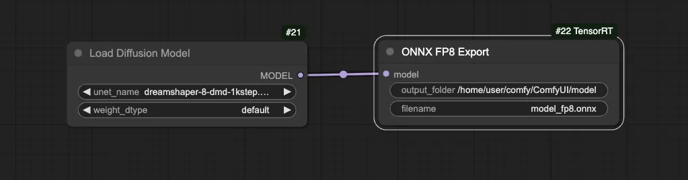
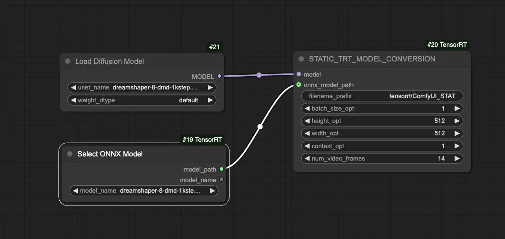
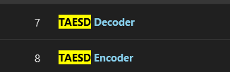

Let's create a fast, useful workflow in ComfyUI and deploy it to ComfyStream.

## Install Custom Nodes for the Workflow

<Note>If you have the official version of the **ComfyUI_TensorRT** custom node installed in your `custom_nodes` directory, you will need to remove it or rename it to `ComfyUI_TensorRT.disabled` to prevent it from being loaded into ComfyUI and interfering with the forked version</Note>

1. Activate the `comfyui` environment before installing nodes

```bash
conda activate comfyui
```

2. Install **ComfyUI_TensorRT**, **Torch Compile** and **Depth Anything Tensorrt** nodes
```bash
cd /workspace/comfyRealtime/ComfyStream/custom_nodes
git clone -b quantization_with_controlnet_fixes https://github.com/yondonfu/ComfyUI_TensorRT.git
cd ComfyUI_TensorRT
pip install -r requirements.txt

cd ..
git clone https://github.com/yondonfu/ComfyUI-Torch-Compile
cd ComfyUI-Torch-Compile
pip install -r requirements.txt

cd ..
git clone https://github.com/yuvraj108c/ComfyUI-Depth-Anything-Tensorrt.git
cd ./ComfyUI-Depth-Anything-Tensorrt
pip install -r requirements.txt
cd ..
```

## Download Models 

1. [Dreamshaper 8 DMD](https://huggingface.co/aaronb/dreamshaper-8-dmd-1kstep/tree/main)
```bash
cd /workspace/ComfyUI/models/unet
wget -O "dreamshaper_8_dmd_1kstep.safetensors" "https://huggingface.co/aaronb/dreamshaper-8-dmd-1kstep/resolve/main/diffusion_pytorch_model.safetensors?download=true"
```

2. [Dreamshaper 8 Weights](https://civitai.com/models/4384/dreamshaper)
```bash
cd /workspace/ComfyUI/models/checkpoints
wget "https://civitai.com/api/download/models/4384?token=YOUR_API_KEY" --content-disposition
```

<Note>To obtain an API key, simply go to your account settings and look for the 'API Keys' section and generate a key. See [Download Models](../reference/download-models) for more information on how to download models from CivitAI.</Note>

Alternatively you can download the model from the CivitAI website using the link above
```bash
cd /workspace/ComfyUI/models/checkpoints
wget "https://civitai.com/api/download/models/MODELID?token=YOUR_TOKEN_HERE" --content-disposition
```

3. [ControlNet Model for DepthAnything](https://huggingface.co/comfyanonymous/ControlNet-v1-1_fp16_safetensors)
```bash
cd /workspace/ComfyUI/models/controlnet
wget https://huggingface.co/comfyanonymous/ControlNet-v1-1_fp16_safetensors/resolve/main/control_v11f1p_sd15_depth_fp16.safetensors?download=true --content-disposition
```

## Build TensorRT Engine for Depth Anything

1. Navigate to the `custom_nodes` directory in your ComfyUI workspace

```bash
cd /workspace/comfyRealtime/ComfyUI/custom_nodes
```

2. Clone the repository

```bash
git clone https://github.com/yuvraj108c/ComfyUI-Depth-Anything-Tensorrt.git
cd ./ComfyUI-Depth-Anything-Tensorrt
```

3. Install the node requirements
```bash
conda activate comfyui
pip install -r requirements.txt
```

4. Download the TensorRT onnx file and build the engine
```bash
wget -O depth_anything_vitl14.onnx https://huggingface.co/yuvraj108c/Depth-Anything-2-Onnx/resolve/main/depth_anything_v2_vitb.onnx?download=true --content-disposition
python export_trt.py
```

5. Copy the TensorRT engine file to the ComfyUI `models` directory

```bash
mkdir -p /workspace/comfyRealtime/ComfyUI/models/tensorrt/depth-anything/
mv depth_anything_vitl14-fp16.engine /workspace/comfyRealtime/ComfyUI/models/tensorrt/depth-anything/
```
<Note>If you are copying files from Windows desktop to WSL, you will not be able to find the directory `/workspace/comfyRealtime/ComfyUI/models`. Use `/workspace/ComfyUI/models` instead.</Note>


## Build Static TensorRT Engine for DreamShaper

To build TensorRT engines, you should have the following packages installed in the `comfystream` environment
```bash
pip install tensorrt-cu12-bindings==10.7.0
pip install tensorrt-cu12-libs==10.7.0
```

1. Start ComfyUI, and in a new workflow add the following nodes 
2. In **ONNX FP8 Export** update the `filename` to something unique.
3. Run the workflow to export the ONNX file.
4. When it is complete, refresh the page so the **FP8 Export** shows up. 
5. Delete or disable the above nodes from the workflow. Add the following nodes 
6. In the **Load Diffusion Model** node: 
    - Set **unet_name** to *dreamshaper_8_dmd_1kstep.safetensors*
    - Set **weight_dtype** to *default*
6. In the **Select ONNX Model** node, select *dreamshaper8_fp8.onnx*
7. In the **STATIC_TRT_MODEL_CONVERSION** node, set the **filename_prefix** to a unique name for this engine. <Warning>If the engine file already exists, an error will occur.</Warning>
8. Run the workflow to generate the TensorRT engine, the output will be stored in the `ComfyUI/output` directory.
<Note>
If you have existing workflows open in other tabs, you must reload the ComfyUI page for the new engine to show in node input field
</Note>

<Info>
Refer to the Readme for [ComfyUI-TensorRT](https://github.com/yondonfu/ComfyUI_TensorRT/tree/quantization_with_controlnet_fixes?tab=readme-ov-file#instructions) for additional info on compiling TensorRT engines
</Info>

## Load Workflow
Now that the engines are built, we can use the workflow!

<Note>If you load the workflow without all of the models and engines built, you will see errors in the nodes that require them. You can still load the workflow and build the models and engines as you go.</Note>

1. Stop ComfyUI by pressing **CTRL-C** in the terminal that is running ComfyUI
2. Start ComfyUI with the `--disable-cuda-malloc` flag to prevent memory allocation errors

```bash
python main.py --listen --disable-cuda-malloc
```

3. Once ComfyUI has started, download the **TAESD Encoder** and **TAESD Decoder**
    - From **ComfyUI Manager** > **Model Manager**, search `TAESD` 

4. Download the [TensorRT Optimized Workflow](https://gist.githubusercontent.com/yondonfu/592a04e075e790981cd401124e0d84e4/raw/0fcf100e0f57cd1dc47621bb4018a9933d9ed2df/workflow.json), and drag and drop the file onto the ComfyUI interface.


## Running The Workflow in ComfyStream

To run TensorRT engines, you should have the following packages installed in the `comfystream` environment
```bash
pip install tensorrt-cu12-bindings==10.7.0
pip install tensorrt-cu12-libs==10.7.0
```

Since we have added new nodes in ComfyUI, proceed to [Install nodes in ComfyStream](../install/custom-node-installation#install-nodes-in-comfystream), before running the workflow in ComfyStream.

If you have two environments (one for ComfyUI and one for ComfyStream), you'll need to copy your generated TensorRT model with the command below:
```bash
cp -r /workspace/ComfyUI/output/tensorrt /workspace/comfyRealtime/ComfyUI/output/
```

