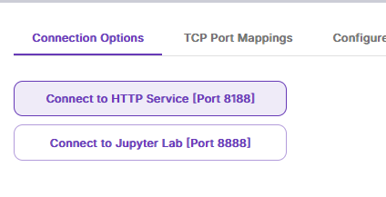

## Setup Environment

We will use the [ComfyStream_Setup_Scripts](https://github.com/ryanontheinside/ComfyStream_Setup_Scripts) to automate the install of conda environments for ComfyStream and ComfyUI.

<Tabs>
    <Tab title="RunPod (Linux)">
        1. Follow the steps in [Deploying a new RunPod Server](../reference/develop-runpod#deploying-a-new-runpod-server) to create a new RunPod server.

        2. From the RunPod dashboard, click **Connect** to obtain the username or port to connect to. There are two examples provided on the **Connection Options** tab. You can alternatively use the web console.
            - Basic SSH Terminal: Uses a unique userid with port 22 (Recommended)
            - SSH over exposed TCP: Uses `root` for the userid and a unique port

        3. In a new terminal navigate to your network volume and clone the ComfyStream Setup Scripts:
        ```bash
        cd /workspace
        git clone https://github.com/ryanontheinside/ComfyStream_Setup_Scripts
        ```
        4. Run the initial setup script:
        ```bash
        chmod +x ComfyStream_Setup_Scripts/runpod/initial_setup.sh
        bash ./ComfyStream_Setup_Scripts/runpod/initial_setup.sh
        ```
        5. Initialize conda by running the following command:
        ```bash
        /workspace/miniconda3/bin/conda init bash
        ```
        <Note>
            When deploying new pods from the network volume you will need to run this initialization command again.
        </Note>
        6. Start a new terminal session in your pod for the change to take effect. You should see `(base)` to the left of the terminal cursor.
    </Tab>
    <Tab title="Local (Windows)">
        1. Clone the ComfyStream Setup Scripts to your home directory
        ```bash
        cd "$env:HOMEPATH"
        git clone https://github.com/ryanontheinside/ComfyStream_Setup_Scripts
        & "$env:HOMEPATH/ComfyStream_Setup_Scripts/local/install_conda.ps1"
        ```
        <Info>
        You may need to enable [script execution](https://learn.microsoft.com/en-us/powershell/module/microsoft.powershell.security/set-executionpolicy?view=powershell-7.4)
        ```bash (admin)
        Set-ExecutionPolicy RemoteSigned -Scope CurrentUser
        ```
        </Info>

        2. If you do not already have Conda, install it from an elevated powershell
        ```bash (admin)
        & "$env:HOMEPATH/miniconda3/Scripts/conda" init powershell
        ```

        3. Open a new Powershell terminal for the changes to take effect

        4. Install ComfyStream, ComfyUI and related packages
        ```bash (admin)
        cd "$env:HOMEPATH"
        & "$env:HOMEPATH/ComfyStream_Setup_Scripts/local/setup_comfystream.ps1"
        ```

        After running the script, you should see the following folders in your current working directory:
        - **ComfyUI**
        - **ComfyStream**

        5. Create a Symbolic link to the models folder for both ComfyUI workspaces 
        ```powershell
        $realtimePath = "$env:HOMEPATH/comfyRealtime/ComfyUI/models"
        $comfyUIPath = "$env:HOMEPATH/ComfyUI/models"
        New-Item -ItemType SymbolicLink -Path $realtimePath -Target $comfyUIPath
        ```
    </Tab>

</Tabs>

## Start ComfyUI
Start a new terminal and activate the `comfyui` conda environment:
<CodeGroup>
```bash RunPod (Linux)
conda activate comfyui
cd /workspace/comfyRealtime/ComfyUI
python main.py --listen
```
```bash Local (Windows)
conda activate comfyui
cd "$env:HOMEPATH/comfyRealtime/ComfyUI"
python main.py --listen
```
</CodeGroup>

<Info>
It is normal to see logs for the tensorrt nodes failing to import, as they are only compatible with ComfyStream. Your list of nodes might vary.
</Info>
```
Import times for custom nodes:
   0.0 seconds (IMPORT FAILED): /ComfyUI/custom_nodes/tensor_utils
   0.0 seconds: /ComfyUI/custom_nodes/ComfyUI-Misc-Effects
   0.0 seconds: /ComfyUI/custom_nodes/ComfyUI-Manager
   0.1 seconds: /ComfyUI/custom_nodes/ComfyUI-SAM2-Realtime
   0.3 seconds (IMPORT FAILED): /ComfyUI/custom_nodes/ComfyUI-Depth-Anything-Tensorrt
   0.5 seconds: /ComfyUI/custom_nodes/ComfyUI_RyanOnTheInside
```

Access ComfyUI from the web interface on port 8188: 
<Tabs>
    <Tab title="RunPod (Linux)">
        From RunPod, click **Connect**, then click **Connect to HTTP Service [Port 8188]** to access ComfyUI:
        

    </Tab>

    <Tab title="Local (Windows)">
        Open a web browser and navigate to `http://localhost:8188` 
    </Tab>
</Tabs>

## Start ComfyStream

1. Activate the comfystream environment
```bash
conda activate comfystream
```
2. Change to the ComfyStream directory
<CodeGroup>
```bash RunPod (Linux)
cd /workspace/comfyRealtime/ComfyStream
```
```bash Local (Windows)
cd "$env:HOMEPATH/comfyRealtime/ComfyUI"
```
</CodeGroup>

3. Start ComfyStream
```bash
python server/app.py --workspace ../ComfyUI --media-ports=5678 --host=0.0.0.0 --port 8889
```

ComfyStream is now running. We will provide this endpoint to the ComfyStream UI when starting a live stream.


## Start ComfyStream UI

Follow [Run ComfyStream UI](../reference/local-testing-comfystream-ui) to start a live stream with your new development environment


## Troubleshooting

If you need to start over due to unresolvable package conflicts, you can delete the conda environments and start over:
```bash
conda deactivate
conda remove --name comfystream --all
conda remove --name comfyui --all
```
Finally, run the setup script again to recreate the conda environments:
<CodeGroup>
```bash RunPod (Linux)
bash ./ComfyStream_Setup_Scripts/runpod/initial_setup.sh
```
```bash Local (Windows)
cd "$env:HOMEPATH"
& "$env:HOMEPATH/ComfyStream_Setup_Scripts/local/setup_comfystream.ps1"
```
</CodeGroup>
