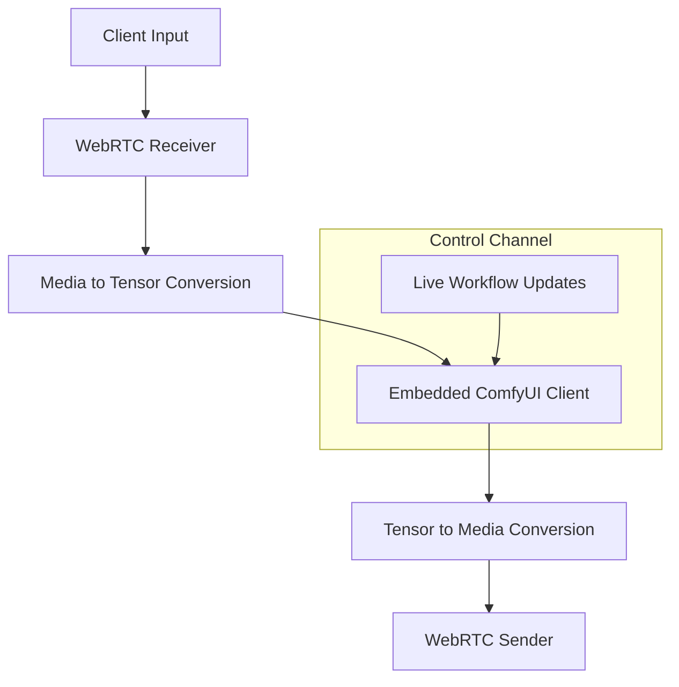

<iframe
  width="100%"
  height="480"
  src="https://www.youtube.com/embed/rhiWCRTTmDk"
  title="Livepeer video player"
  frameborder="0"
  allow="accelerometer; autoplay; clipboard-write; encrypted-media; gyroscope; picture-in-picture"
  allowfullscreen
/>

## Overview

The **ComfyStream toolkit** adds powerful real-time video and audio capabilities to [ComfyUI](https://www.comfy.org/), making it easy to build interactive, AI-powered media workflows. It extends ComfyUI with specialized tools for streaming, live processing, and on-the-fly workflow updates, including:

- **[ComfyStream](https://github.com/livepeer/comfystream)** – A custom node that streams audio and video from your webcam and microphone into ComfyUI for real-time AI processing, then returns the processed output.
- **[ComfyUI-Stream-Pack](https://github.com/livepeer/ComfyUI-Stream-Pack)** – A collection of custom nodes designed to support advanced real-time audio and video workflows.

To help you get started, ComfyStream also includes a [knowledge base](https://docs.comfystream.com/) with foundational workflows, optimization tips, and in-depth guides on all tools and nodes.

## Getting Started

To get started, follow the installation guide below or explore the stream pack for additional nodes.

<CardGroup cols={2}>
  <Card title="Install ComfyStream" icon="download" href="install">
    Step-by-step instructions to install ComfyStream and start creating
    real-time workflows.
  </Card>
  <Card
    title="Check out the ComfyUI-Stream-Pack"
    icon="cube"
    href="https://github.com/livepeer/ComfyUI-Stream-Pack"
  >
    A collection of custom nodes for building realtime audio and video
    workflows.
  </Card>
</CardGroup>

## How It Works

ComfyStream enables real-time processing of audio and video streams by integrating a [WebRTC](https://webrtc.org/) server for low-latency, bidirectional communication, a custom tensor-based pipeline for converting media frames to and from tensors, and ComfyUI's [EmbeddedComfyClient](https://github.com/hiddenswitch/ComfyUI/blob/ffc1912eff10cf57aec4fee358a5b6946e74a9e5/comfy/client/embedded_comfy_client.py#L123) for AI inference.

### Data Flow Overview

Here's how the system processes live audio and video end-to-end:

1. **Input:** WebRTC receives video, audio, and control data from the client.
2. **Workflow Injection:** The pipeline dynamically modifies the ComfyUI workflow by replacing standard input/output nodes with custom tensor nodes.
3. **Inference:** The EmbeddedComfyClient processes incoming tensors in real-time using the updated workflow.
4. **Output Conversion:** Processed tensors are converted back to video and audio, and streamed back to the client via WebRTC.
5. **Live Control:** A control channel allows the client to update the workflow or modify parameters on the fly, without restarting the session.

This high-level overview is visualized below:

