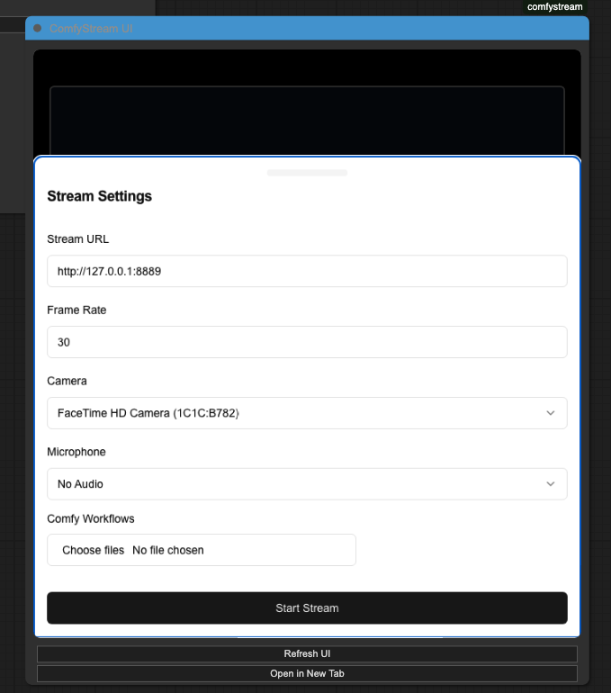
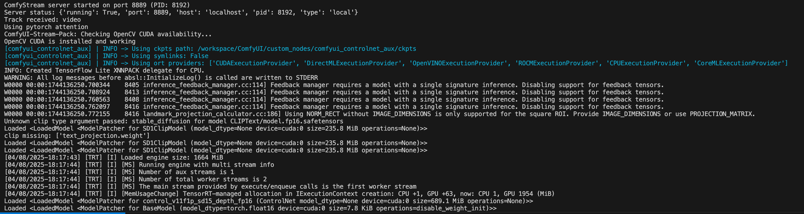

After you have successfully installed ComfyStream by following the [installation guide](install), you can run your first AI workflow.

## Prerequisites

### Download Example Workflows
There are example workflows in the GitHub repository [Comfystream](https://github.com/livepeer/comfystream/tree/main/workflows/comfystream). Download one to test your setup.

## Accessing ComfyStream UI

<AccordionGroup>
  <Accordion title="ComfyStream UI Preview Window">
    When you click the ComfyStream node and select **ComfyStream UI Preview** in ComfyUI, it will open a window that looks similar to the image below:
    
  </Accordion>

  <Accordion title="Standalone Browser Tab">
    If you prefer to run workflows in a new tab rather than inside ComfyUI, click **Open ComfyStream UI** from the [ComfyStream Menu](install#accessing-comfystream).
    This will open a similar dialog box in a new browser tab.
  </Accordion>
</AccordionGroup>

<Note>
Opening the UI will ask for permission to access your video and audio so it can stream your webcam and microphone. You need to provide access to use ComfyStream.
</Note>

## Running Your First Workflow

<Steps>
  <Step title="Select your workflow">
    Click on **Choose files** and select the previously downloaded workflow from the [Comfystream repository](https://github.com/livepeer/comfystream/tree/main/workflows/comfystream).
  </Step>
  
  <Step title="Start ComfyStream">
    Click on **Start Stream** to start the workflow. Once you start the stream, it will run the workflow in the background and you will see **Starting Stream..** at the bottom of the page.
    
    Depending on the workflow complexity, it may take some time to start the stream. Please wait patiently.
  </Step>
  
  <Step title="Enjoy your stream">
    Once the stream starts you will see the AI effects being applied in real-time.
  </Step>
</Steps>

## Troubleshooting

<Note>
For advanced users, you can check the logs in the ComfyStream server to see if everything is loading properly without any major errors.
</Note>

<Accordion title="Reference Image - Server Logs">

</Accordion>
