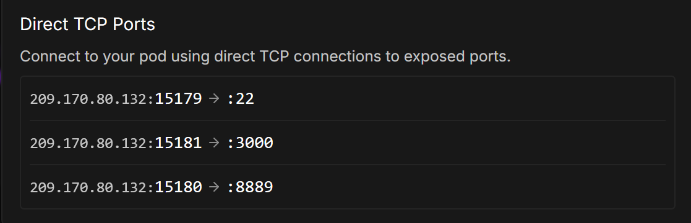

ComfyStream is available as a docker image at [livepeer/comfystream:latest](https://hub.docker.com/r/livepeer/comfystream). An NVIDIA GPU is required to run ComfyStream. 

Choose a platform to install ComfyStream:
<CardGroup cols={2}>
  <Card title="Local GPU" icon="square-1" href="#local-gpu">
    Run ComfyStream and ComfyUI on Linux or Windows with a local GPU
  </Card>
  <Card title="Remote GPU" icon="square-2" href="#remote-gpu">
    Run ComfyStream and ComfyUI on RunPod with a rented GPU
  </Card>
</CardGroup>

---

<h2>Local GPU</h2>

### Prerequisites

First, install the required system software:
<AccordionGroup>
  <Accordion title="Linux">
    - [Docker Engine](https://docs.docker.com/engine/install/ubuntu/#install-using-the-repository)
    - [NVIDIA CUDA Toolkit](https://developer.nvidia.com/cuda-12-6-3-download-archive?target_os=Linux&target_arch=x86_64&Distribution=Ubuntu)
    - [NVIDIA Container Toolkit](https://docs.nvidia.com/datacenter/cloud-native/container-toolkit/latest/install-guide.html)
  </Accordion>

  <Accordion title="Windows">
    - [Docker Desktop for Windows](https://docs.docker.com/get-started/introduction/get-docker-desktop/)
    - [NVIDIA CUDA Toolkit](https://developer.nvidia.com/cuda-12-6-3-download-archive?target_os=Windows&target_arch=x86_64&target_version=11&target_type=exe_local)
  </Accordion>
</AccordionGroup>

### Setting Up Local Environment 

1. Create directories for models and output:

<CodeGroup>
```bash Linux
mkdir -p ~/models/ComfyUI--models ~/models/ComfyUI--output  
```
```batch Command Line
mkdir %USERPROFILE%\models\ComfyUI--models %USERPROFILE%\models\ComfyUI--output
```
```powershell PowerShell
New-Item -ItemType Directory -Path "$env:USERPROFILE\models\ComfyUI--models", "$env:USERPROFILE\models\ComfyUI--output"
```
</CodeGroup>

2. Pull and run the container:

```bash
docker pull livepeer/comfystream:latest
```

<Info>
If using Windows, ensure Docker Desktop is running first
</Info>

<CodeGroup>
```bash Linux
docker run -it --gpus all \
-p 8188:8188 \
-p 8888:8888 \
-p 5678:5678 \
-p 3000:3000 \
-v ~/models/ComfyUI--models:/workspace/ComfyUI/models \
-v ~/models/ComfyUI--output:/workspace/ComfyUI/output \
livepeer/comfystream:latest --download-models --build-engines --server
```
```batch Command Line
docker run -it --gpus all ^
-p 8188:8188 ^
-p 8888:8888 ^
-p 5678:5678 ^
-p 3000:3000 ^
-v %USERPROFILE%\models\ComfyUI--models:/workspace/ComfyUI/models ^
-v %USERPROFILE%\models\ComfyUI--output:/workspace/ComfyUI/output ^
livepeer/comfystream:latest --download-models --build-engines --server
```
```powershell PowerShell
docker run -it --gpus all `
-p 8188:8188 `
-p 8888:8888 `
-p 5678:5678 `
-p 3000:3000 `
-v $env:USERPROFILE\models\ComfyUI--models:/workspace/ComfyUI/models `
-v $env:USERPROFILE\models\ComfyUI--output:/workspace/ComfyUI/output `
livepeer/comfystream:latest --download-models --build-engines --server
```
</CodeGroup>

<Note>
The `--download-models` and `--build-engines` flags will download required models and build TensorRT engines. This process may take some time depending on your network connection and GPU hardware and is only needed on the first run or when adding new models.
</Note>

---

<h2 id="remote-gpu">Remote GPU</h2>

### Deploy on RunPod

1. Deploy using the [livepeer-comfystream](https://runpod.io/console/deploy?template=w01m180vxx&ref=u8tlskew) template
2. Create and select a network volume to persist files

3. Select an appropriate GPU (ex: RTX 4090) and click **Deploy On-Demand**

<Note>
For faster deployment without data persistence, use [livepeer-comfystream-novolume](https://runpod.io/console/deploy?template=j4p1g7t5vs&ref=u8tlskew).
</Note>

<Warning>
First-time deployment to a network volume takes approximately 20-45 minutes depending on pod performance. Future pod restarts will be faster.

Click the **Logs** button to monitor deployment progress.
</Warning>

---


## Accessing ComfyStream and ComfyUI 

### Local Environment
For local deployments, services are available at:
- ComfyUI: [http://localhost:8188](http://localhost:8188)
- ComfyStream: [http://localhost:8889](http://localhost:8889)
- UI: [https://localhost:3000](https://localhost:3000)

### RunPod Environment
1. Click **Connect** in pod dashboard

2. Access ComfyUI: **HTTP Service -> :8188**
3. To access ComfyStream:

 - Copy the external IP and Port for the port 3000 mapping. 
 - Paste it into your browser with **https://** prefix

 - In the example above, the ComfyStream URL would be: `https://209.170.80.132:15181`
 
<Note>
You will receive an invalid security certificate warning, click Advanced and proceed to the site.
</Note>
4. You now have ComfyUI and ComfyStream running on RunPod!
