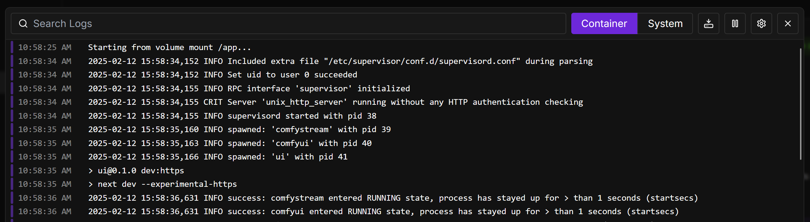
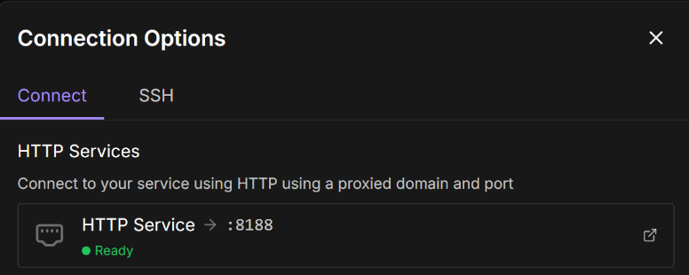
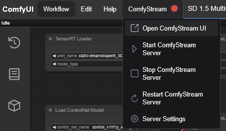
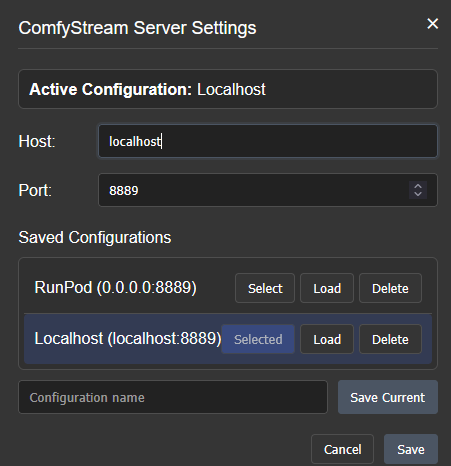
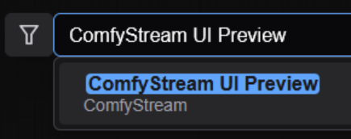

ComfyStream is available as a docker image at [livepeer/comfystream:stable](https://hub.docker.com/r/livepeer/comfystream/tags?name=stable). An NVIDIA GPU is required to run ComfyStream. 

Choose a platform to install ComfyStream:
<CardGroup cols={2}>
  <Card title="Local GPU" icon="square-1" href="#local-gpu">
    Run ComfyStream and ComfyUI on Linux or Windows with a local GPU
  </Card>
  <Card title="Remote GPU" icon="square-2" href="#remote-gpu">
    Run ComfyStream and ComfyUI on RunPod with a rented GPU
  </Card>
</CardGroup>

<h2>Local GPU</h2>

### Prerequisites

First, install the required system software:
<AccordionGroup>
  <Accordion title="Linux">
    - [Docker Engine](https://docs.docker.com/engine/install/ubuntu/#install-using-the-repository)
    - [NVIDIA CUDA Toolkit](https://developer.nvidia.com/cuda-12-6-3-download-archive?target_os=Linux&target_arch=x86_64&Distribution=Ubuntu)
    - [NVIDIA Container Toolkit](https://docs.nvidia.com/datacenter/cloud-native/container-toolkit/latest/install-guide.html)
  </Accordion>

  <Accordion title="Windows">
    1. Install WSL 2:
      - From a new command prompt, run: `wsl --install`
      - Update WSL if needed: `wsl.exe --update`
    2. Launch a new Terminal, then open a tab for **Ubuntu (WSL)**.
    3. Inside of WSL, install [NVIDIA CUDA Toolkit](https://developer.nvidia.com/cuda-12-6-3-download-archive?target_os=Windows&target_arch=x86_64&target_version=11&target_type=exe_local) for WSL.
    4. Install [Docker Desktop for Windows](https://docs.docker.com/get-started/introduction/get-docker-desktop/) for Windows.
    5. Ensure WSL 2 Engine is enabled in Docker Desktop settings.
    6. Inside of WSL, run `docker ps` to verify you have access to docker. 
    7. From the WSL Terminal, continue with the steps below to setup the local environment
  </Accordion>
</AccordionGroup>

### Setting Up Local Environment 

1. Create directories for models and output:

<CodeGroup>
```bash Linux
mkdir -p ~/models/ComfyUI--models ~/models/ComfyUI--output  
```
```batch Command Line
mkdir %USERPROFILE%\models\ComfyUI--models %USERPROFILE%\models\ComfyUI--output
```
```powershell PowerShell
New-Item -ItemType Directory -Path "$env:USERPROFILE\models\ComfyUI--models", "$env:USERPROFILE\models\ComfyUI--output"
```
</CodeGroup>

2. Pull and run the container:

```bash
docker pull livepeer/comfystream:stable
```

<Info>
If using Windows, ensure Docker Desktop is running first
</Info>

<CodeGroup>
```bash Linux/WSL
docker run -it --gpus all \
-p 8188:8188 \
-p 8889:8889 \
-p 5678:5678 \
-v ~/models/ComfyUI--models:/workspace/ComfyUI/models \
-v ~/models/ComfyUI--output:/workspace/ComfyUI/output \
livepeer/comfystream:stable --download-models --build-engines --server
```
</CodeGroup>

<Note>
The `--download-models` and `--build-engines` flags will download required models and build TensorRT engines. This process may take some time depending on your network connection and GPU hardware and is only needed on the first run or when adding new models.
</Note>

<h2 id="remote-gpu">Remote GPU</h2>

### Deploy on RunPod

1. Deploy using the RunPod template 
[livepeer-comfystream](https://runpod.io/console/deploy?template=w01m180vxx&ref=u8tlskew)
<Note>
First-time deployment to a network volume takes approximately 20-45 minutes depending on pod performance. 
For faster deployment without data persistence, use the RunPod template [livepeer-comfystream-novolume](https://runpod.io/console/deploy?template=j4p1g7t5vs&ref=u8tlskew)
</Note>
2. When using the [livepeer-comfystream](https://runpod.io/console/deploy?template=w01m180vxx&ref=u8tlskew) template, create and select a network volume to persist files.

3. Select an appropriate GPU (ex: RTX 4090) and click **Deploy On-Demand**
4. Click the **Logs** button to monitor deployment progress.

5. Once the container is fully running, you can access ComfyUI by clicking **Connect**


## Accessing ComfyUI
<AccordionGroup>
  <Accordion title="RunPod">
  1. Click **Connect** in pod dashboard
    
  2. Access ComfyUI: **HTTP Service -> :8188**
  3. ComfyUI will open in a new tab
  </Accordion>

  <Accordion title="Local">
  When running the docker image locally, you can access ComfyUI at [http://localhost:8188](http://localhost:8188).
  </Accordion>
</AccordionGroup>

## Accessing ComfyStream 
1. From ComfyUI, click the **ComfyStream** menu button:


2. Click **Server Settings** to verify ComfyStream is configured to bind to the correct interface and port <Note>When deploying to remote environments like RunPod, you will need to set the Host to `0.0.0.0`. </Note>

3. Click **Save**.
4. Open the **ComfyStream** menu again, then click **Start ComfyStream Server**. Wait for the server status indicator to turn green. 
<Note>
You can also monitor ComfyStream server logs in ComfyUI's log terminal tab.
</Note>
5. Click **Open ComfyStream UI** to launch in a new tab.
Alternatively, you can double-click the node graph and search for **ComfyStream UI Preview**

