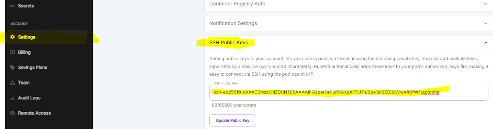
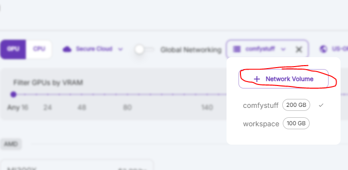
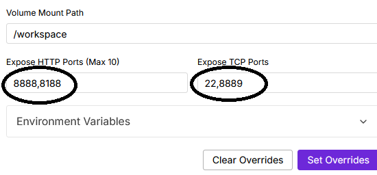

## Creating a new RunPod Account and SSH key pair
1. Create a [RunPod.io](https://runpod.io) account, and add some funds.

2. Start a Powershell or terminal of your choice, then run a command like the following:
```bash
ssh-keygen -t ed25519 -C "your_email@example.com"
```
<Note>
This will generate a pair of files. For me, the files are `ryanrunpod`, and `ryanrunpod.pub`
</Note>

## Add SSH public key to RunPod

1. Locate your public key file (the one that ends in .pub), open it in notepad, and copy the contents 

2. Add the public key to your RunPod account **Settings** > **SSH Public Keys**.


3. From the RunPod dashboard, click **Connect** to obtain the username or port to connect to. There are two examples provided on the **Connection Options** tab. You can alternatively use the web console.
    - Basic SSH Terminal: Uses a unique userid with port 22 (Recommended)
    - SSH over exposed TCP: Uses `root` for the userid and a unique port

<Note>If you're adding this SSH key with a server running, you will need to start a new shell session for it to work!</Note>

SSH is now set up for your RunPod account, so you can use it with any servers you provision.

## Deploying a new RunPod server
1. From the **Pods** page, click **Deploy**
2. Select an appropriate GPU (ex: RTX 4090) and make the following changes:
    1. Click **Storage**, then **Network Volume**. Pick a suitable name, region, and size for the volume. You can add more size later if you run out.  <Warning>It is important to create a network volume, otherwise, your data will be lost when the server is stopped.</Warning>
    2. Click **Change Template**, select `Torch 2.4.0` <Note>Alternatively, you can choose this [RunPod template](https://runpod.io/console/deploy?template=6dj77fsqa8&ref=u8tlskew) which is pre-configured with the settings below</Note>
    3. Click **Edit Template**, set the ports:
        - **Expose HTTP Ports** to `8888,8188`
        - **Expose TCP Ports** to `22,8889`  
       
    4. Click **Set Overrides** to save the changes
3. Click **Deploy On-Demand**
4. Proceed to [Install Conda, ComfyUI, and ComfyStream](../install/local-testing)

## **Stopping a RunPod Server**
Stopping pods helps lower costs on RunPod. Pods must also be stopped before making any port mapping changes.

To stop a RunPod server, you can run the following command from *inside* the pod:
```bash
 runpodctl stop pod YOUR_PODID
```